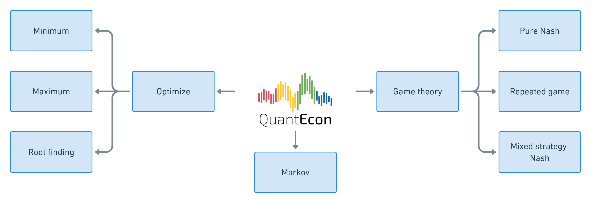
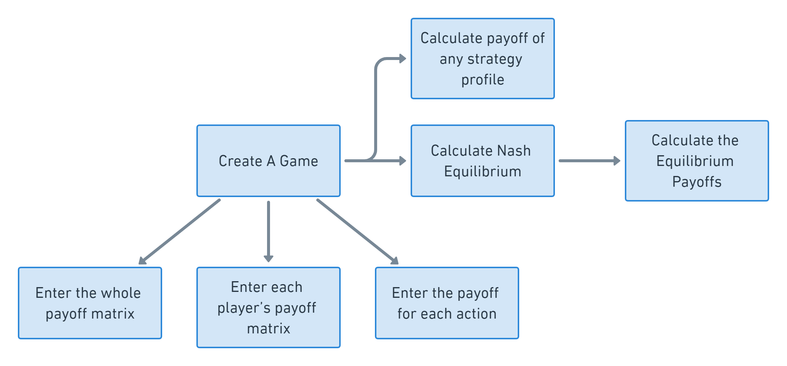
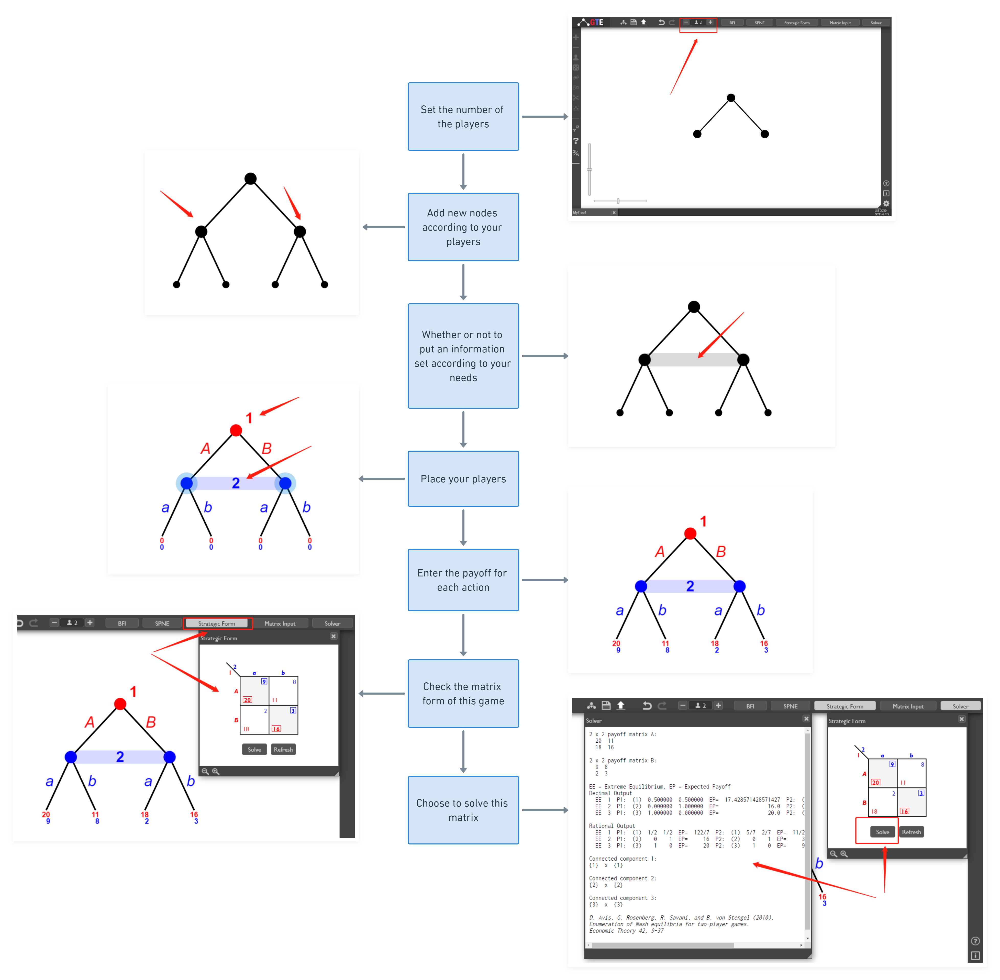
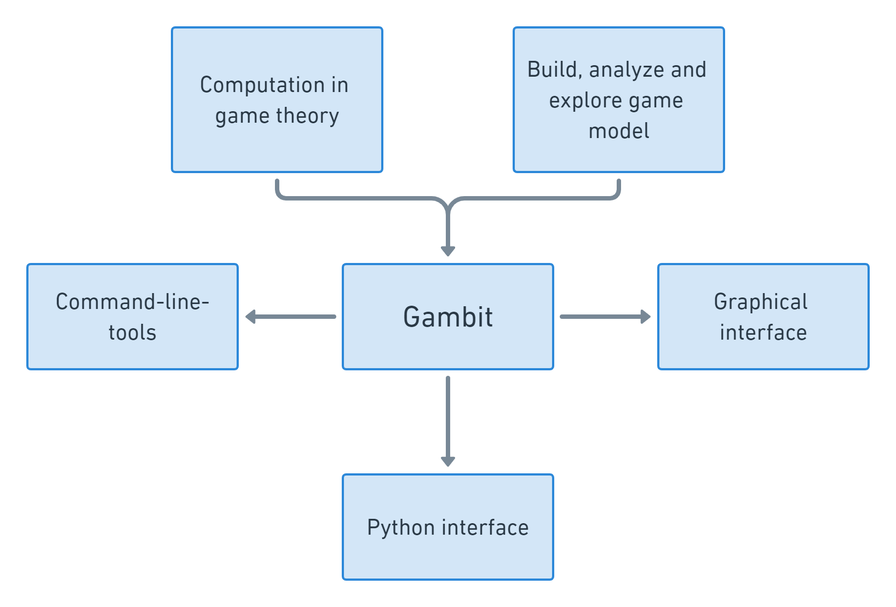
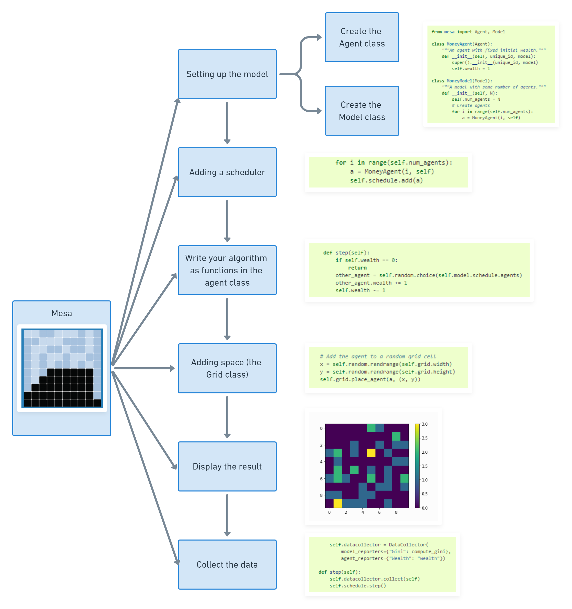

# Table of Contents

### [1. Introduction](#Introduction)

### [2. Nashpy](#Nashpy)

### [3. QuantEcon](#QuantEcon)

### [4. Game Theory Explorer](#Game-Theory-Explorer)

### [5. Gambit](#Gambit)

### [6. Mesa](#Mesa)

### [7. Case Studies](#Case-Studies)

# Introduction
In these instructions, we introduce five Python Packages for Economics: Nashpy, QuantEcon, Game Theory Explorer, Gambit and Mesa. All the five packages are useful for modelling and simulations. 
Both Nashpy and QuantEcon are able to solve simple game theory problems. To be specific, Nashpy is a Python library used for the computation of equilibria in 2 player strategic form games while QuantEcon offers additional computational tools for economics, econometrics, and decision making. Game Theory Explorer (GTE) and Gambit are used for simulating and solving extensive games. GTE is an online graphical user interface for small and medium size games while Gambit provides more complete functions. Mesa is a Python framework for agent-based modeling.
In the first four sections, we introduce each software by providing the references, license information and  required citations. In the last section, we present a case study for each software. 

# Nashpy
[Documentation](https://nashpy.readthedocs.io/en/stable/index.html)
## 1. Introduction
[Nashpy](https://github.com/drvinceknight/Nashpy) is a Python library for the computation of equilibria in 2 player strategic form games ([Nashpy](https://nashpy.readthedocs.io/en/stable/), 2017). Check [This document](https://nashpy.readthedocs.io/en/stable/) for instructions.

    
    
Figure 1: The functionings of Nashpy

## 2. License
Nashpy is Free/Open Source software, released under the terms of the MIT License.
## 3. Required Citation
Vincent Knight (2021).*Nashpy: a python library for the computation of equilibria of 2 player strategic games*, Version 0.0.28. https://github.com/drvinceknight/Nashpy
## 4. Example
In this [Colab Notebook 1: NashPy](https://github.com/SciEcon/Intelligent-Economics/blob/main/project1/Colab%20Notebook%20NashPy%20vs%20QuantEcon.ipynb), we demonstrate how to solve the Nash Equilibrium of three classic games using Nashpy: the prisoner’s dilemma, matching pennies, and battle of sex in Nashpy. 

# QuantEcon
[Documentation](https://quanteconpy.readthedocs.io/en/latest/)
[Website](https://quantecon.org/)
## 1. Introduction
[QuantEcon](https://quantecon.org/) is a project dedicated to development of open source computational tools for economics, econometrics and decision making ([QuantEcon](https://quantecon.org), n.d.). Check [this document](https://quantecon.org/quantecon-py/) to learn how to access QuantEcon via Python.

***Figure 2.1:QuantEcon overview***

## 2. License
Nashpy is Free/Open Source software, released under the terms of the BSD-3-Clause License.
## 3. Required Citation
Thomas J. Sargent and John Stachurski (2021), *Quantitative Economics (Python)*, Version 0.5.1. https://quantecon.org/quantecon-py/
## 4. Example
Chart 2.2 Represents the pipeline to solve for Nash Equilibrium (NE) of Battle of Sexes in QuantEcon. In this [Colab Notebook 2: Nashpy vs QuantEcon](https://github.com/SciEcon-GameTheory/QuantEcon-vs-Nashpy/blob/main/Nashpy%20%20%26%20QuantEcon.ipynb), we compare Nashpy and QuantEcon packages for solving matrix games in a concrete example. 

***Figure 2.2:QuantEcon Examples - Battle of Sexes***

# Game Theory Explorer
[Documentation](http://www.maths.lse.ac.uk/Personal/stengel/TEXTE/largeongte.pdf)
[Webiste](http://www.gametheoryexplorer.org/)
[Apps in the Could](http://app.test.logos.bg/)
### 1. Introduction
[Game theory Explorer (GTE)](http://www.gametheoryexplorer.org/) software allows researchers to create games in extensive form and to compute equilibria accordingly, and provides an intuitive representation of the Game Tree ([Savani et al.](http://www.maths.lse.ac.uk/Personal/stengel/TEXTE/largeongte.pdf), 2014). Check [this document](http://www.maths.lse.ac.uk/Personal/stengel/TEXTE/largeongte.pdf) to learn more about GTE.
### 2. License
All GTE software is open source and free to use and alter under the GNU General Public Licence.
### 3. Required Citation
Rahul Savani and Bernhard von Stengel (2015), Game Theory Explorer – Software for the Applied Game Theorist. *Computational Management Science 12, 5*-33.
### 4. Example
Figure 3 demonstrate how we create the game tree successfully and solve for the equilibrium.

***Figure 3: Chart for Game Theory Explorer example***

# Gambit
[Website](http://www.gambit-project.org/)
### 1. Introduction
[Gambit](http://www.gambit-project.org/) is an open-source collection of tools for doing computation in game theory ([Gambit](http://www.gambit-project.org), 2017). It provides a graphical interface to help get intuition about simple games and command-line tools and Python scripting API to support practical applications. However, the Python API is sometimes not stable and the graphical interface is more recommended. Check [official website](http://www.gambit-project.org/) to get started with Gambit.

***Figure 4: Gambit overview***

### 2. License
Gambit is Free/Open Source software, released under the terms of the GNU General Public License.
### 3. Required Citation
McKelvey, Richard D., McLennan, Andrew M., and Turocy, Theodore L. (2014). *Gambit: Software Tools for Game Theory*, Version 16.0.1. http://www.gambit-project.org. 
### 4. Example
Here we provide an example of solving an imperfect information game with Gambit. The game is constructed as shown in Figure 5. Notice that in the game tree we constructed below is asymmetric and has an information set, which means it is an imperfect information game. By using GTE, we are not able to solve this kind of imperfect information and asymmetric game, while Gambit allows us to achieve that. You can download the Gambit graphical interface via [this link](https://sourceforge.net/projects/gambit/files/). Check [this document](http://www.gambit-project.org/gambit15/gui.html) to learn how to use the interface.

    

***Figure 5: Construct and solve imperfect information game with Gambit***

# Mesa
[Documentation](https://mesa.readthedocs.io/en/latest/tutorials/intro_tutorial.html)
[Github](https://github.com/projectmesa/mesa)

### 1. Introduction
[Mesa](https://mesa.readthedocs.io/en/latest/tutorials/intro_tutorial.html) is a modular framework for building, analyzing and visualizing agent-based models. Agent-based models are computer simulations involving multiple entities (the agents) acting and interacting with one another based on their programmed behavior ([Mesa](https://mesa.readthedocs.io/en/latest/overview.html), 2021). Check [this document](https://mesa.readthedocs.io/en/latest/tutorials/intro_tutorial.html) to learn more about Mesa. 

***Figure 6: Mesa Overview***
### 2. License
Mesa is an Apache2 licensed agent-based modeling (or ABM) framework in Python.
### 3. Required Citation
Kazil, Jackie, Masad, David, Crooks and Andrew (2020). *Utilizing Python for Agent-Based Modeling: The Mesa Framework.* https://github.com/projectmesa/mesa
### 4. Example
In the [Colab Notebook 3: Mesa](https://github.com/SciEcon-GameTheory/mesa_based_118), we used Mesa to simulate an evolutionary game in the paper entitled “Evolutionary Game for Mining Pool Selection in Blockchain Networks.” This paper studies the dynamics of mining pool selection in a blockchain network, where mining pools may choose arbitrary block mining strategies. We simulate the two pool cases and visualize the miners’ dynamic switching between these two pools. Figure 7 presents the pseudo code. 

    

***Figure 7.1: Mesa Example 1: Pseudo Code***

***Figure 7.2: Mesa example 2: the Pipeline***

# Case Studies
In this section, we provide a case study for each software mentioned in the first four sections by presenting sample code assignments that utilize the four software packages for solving game theory problems. The assignments consist of three parts: Part I: Normal Form Game;  Part II: Extensive Form Game; Part II: Evolutionary Game. We provide sample questions and answers in two separate colab notebooks （[Colab Notebook Case Study Questions](https://github.com/SciEcon/Intelligent-Economics/blob/main/project1/Colab%20Notebook%20Case%20Study%20Questions.ipynb),[Colab Notebook Case Study Answer](https://github.com/SciEcon/Intelligent-Economics/blob/main/project1/Colab%20Notebook%20Case%20Study%20Answer.ipynb)).
#### Normal Form Game [Part I]
In this part, we provide problem sets for solving two normal form games, one classical game [Battle of sexes](https://drive.google.com/file/d/1hrB5j_zaUfZbsT-ZQk4tzsZqQYkCYa-f/view) (Noam Nisan et. al, 2007, p.7 ), one related to Blockchain application [The miners’ dilemma](https://drive.google.com/file/d/1sB3yaIghyrGv2rPZ7FhSvfO1-prBKCrJ/view) (Ittay, 2015). Students are asked to use NashPy and QuantEcon to get pure equilibrium strategies and mixed equilibrium strategies. 
#### Extensive Form Game [Part II]
In this part, we provide problem sets for solving two extensive form games, one classical [Game of moving](https://drive.google.com/file/d/1hrB5j_zaUfZbsT-ZQk4tzsZqQYkCYa-f/view) (Noam Nisan et. al, 2007, pp. 67-68), one related to the Blockchain [Finite Blockchain game](https://drive.google.com/file/d/11d_DHOEsilm4YC2L5RKg_kaU8vLVV8S1/view) (Ewerhart et al. 2020). Students are asked to use Game Theory Explorer (GTE) to solve the extensive form game with perfect information and Gambit to solve the extensive form game with imperfect Information.
#### Evolutionary Game [Part III]
In this part, we provide problem sets for solving two evolutionary games, one classical [The evolutionary equilibrium of block withholding attack](https://drive.google.com/file/d/1SxFJUtAPWuUHEsQUixkbQTT9lKhzDtNn/view), (Cheng et. al, 2021) and the other related to block chain [Mining Pool Selection](https://drive.google.com/file/d/1W3m9p5OyB3IcHPxIKVFpRkk9Co6Yrztd/view) (Liu et. al, 2018). Students are asked to use Mesa to do agent-based modelling to simulate these two evolutionary games.
