# Table of Contents

### [1. Introduction](#introduction)

### [2. Resources](#resources)

### [3. Step-by-Step Guide](#step-by-step-guide)

### [4. Conclusion](#conclusion)

---

## Introduction

oTree is an open-source platform for making surveys and experiments. In this tutorial, we describe how to make a simple questionnaire application with oTree, covering the use of oTreeHub, modifying the oTree application on PyCharm, and how to run and release the oTree application on local and online platforms.

## Resources

- Official Website: https://www.otree.org/ [700 Google Scholar Publications](https://scholar.google.com/scholar?hl=en&as_sdt=2005&cites=5704587714172176698&scipsc=&q=&scisbd=1)
- Otree google Group Forum: https://groups.google.com/g/otree
General Programming Questions: [Stack Overflow](https://stackoverflow.com/)
- Documentations: https://otree.readthedocs.io/en/latest/
- License: MIT (with restrictions)
- The original paper describes oTree software distribution: [oTree—An open-source platform for laboratory, online, and field experiments](https://www.sciencedirect.com/science/article/pii/S2214635016000101)
- YouTube Tutorials: [Series 1 2021](https://www.youtube.com/channel/UCI-kL2lFnRZ73GbmhJfWo4w) [Series 2 2020](https://www.youtube.com/channel/UCLZ8oxx9dl7WbLC4J0wBunw)

## Step-by-Step Guide

Figure 0 demonstrates the oTree pipeline for software development. If you are a newbie to programming, you will be able to develop software for a variety of experiments using the humanity approach. If you are an experienced programmer, you also can further customize your software. In this step-by-step guide, we mainly demonstrate the humanity approach but also demonstrate where the developer approach contributes more.  

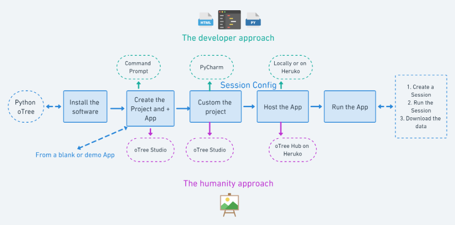

<p align = "center">
Figure 0: oTree Pipeline
</p>

### Install the Software

You can find more instructions in oTree documentation [Installing oTree](https://otree.readthedocs.io/en/latest/install.html).

#### Python

Before installing **oTree**, it is required to have **Python 3** (and **pip**) installed in your environment to run oTree. Here are the instructions for installing the software:
- [Python 3 Installation Guide](https://realpython.com/installing-python/)
- [Pip installation guide](https://pip.pypa.io/en/stable/installation/) (Install pip manually if it was not installed automatically)

#### oTree

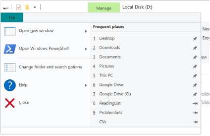

<p align = "center">
Figure 1: Open Windows PowerShell
</p>

oTree can be installed through pip. Open the terminal (Mac/Linux) or command prompt (Windows PowerShell) and type:

```shell
pip3 install -U otree
```

After the command ends, the installation is complete.

#### PyCharm (optional)

PyCharm is a famous Python IDE (Integrated Development Environment). We recommend you to use PyCharm if you want to further customize your oTree app by programming. Please go to [this website](https://www.jetbrains.com/pycharm/download/#section=mac) to download the installation package. For oTree development, a free community version should be sufficient.

### Create the Project

If you are a newcomer, it is **highly recommended** to use [oTree Studio](https://otree.readthedocs.io/en/latest/studio.html) to create and edit the project instead of hard coding. Please click [this link](https://www.otreehub.com/accounts/login/?next=/studio/) to register an account then log in. After the command ends, the installation is complete.

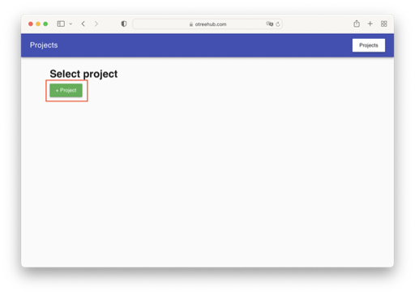

<p align = "center">
Figure 2: Create Project
</p>

Click the “**+ Project**” button to create a new project. 

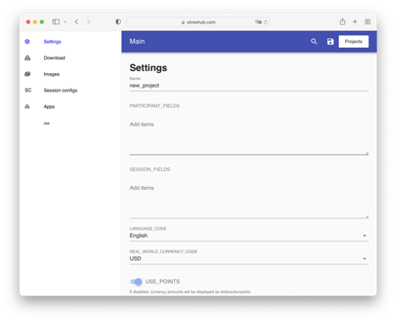

<p align = "center">
Figure 3: Project Configuration
</p>

Then you’re able to visit the project configuration page where you can config the meta data for your project. In this instruction, we’re going to create a simple survey, including two pages to collect information and one page to display the result. 

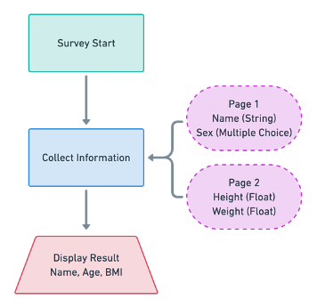

<p align = "center">
Figure 4: Logic Flow
</p>

Figure 4 illustrates the logic flow of the survey application we’re going to create. The survey application includes two parts, information collection, and result display. In the first section, we will collect the name, sex, heigh weight of the subject. In the second section, we will display the name, age of the subject and calculate his/her BMI.

### Customize the project

#### Customize the project on oTree Studio

We define the information we want to collect as variables. 

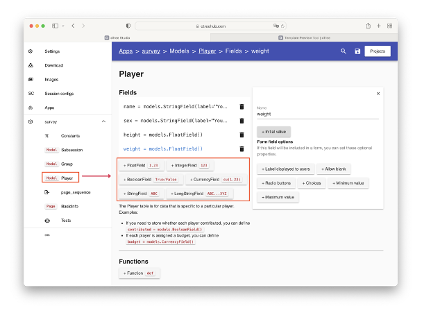

<p align = "center">
Figure 5: Define Variables
</p>

As shown in figure 5, we go to the player page by clicking the button on the sidebar where we can create variables by adding fields. For our case, we define the `name` as a string field, `sex` as a string field with multiple choices, then weight and height as float fields. 

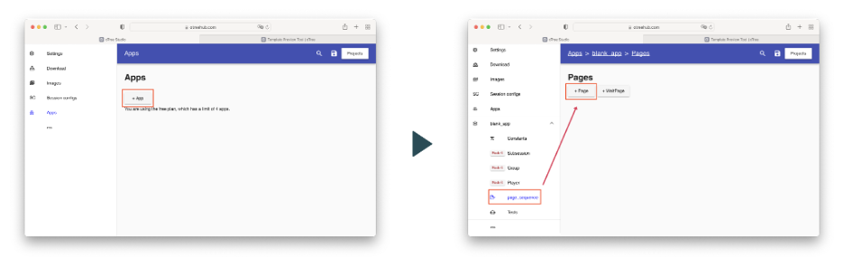

<p align = "center">
Figure 6: Create App
</p>

Click the **“+ App”** button to create an app and select the **“blank app”** template. After the new app is created, go to the page sequence page, click **“+ Page”** to add a new page. 

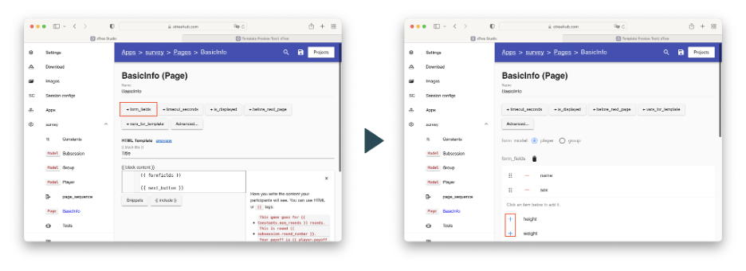

<p align = "center">
Figure 7: Add Form Field (Page 1)
</p>

Next, click **“+ form_field”** to add the form to this page, then click the **“+”** button in front of the variable to add the item to the form. On the first page, we select `name` and `sex` variables.

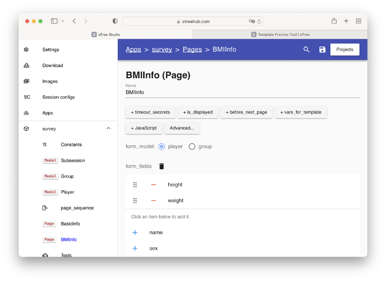

<p align = "center">
Figure 8: Add Form Field (Page 1)
</p>

Do similar things on the second page, but we’d like to add variables `height` and `weight` this time. Next, we want to create a page to display the information of the subject and his/her `BMI`. 

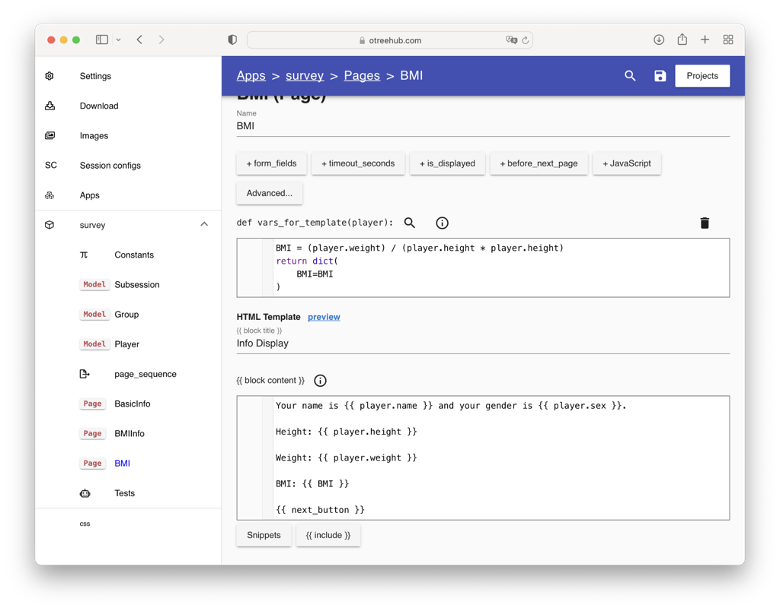

<p align = "center">
Figure 9: Info Display Page
</p>

On this page, we customize the information displayed to the subject. First, a customized function to calculate the `BMI` is defined:

```python
BMI = (player.weight) / (player.height * player.height)
return dict(
    BMI=BMI
)
```

Then, we code the text to be displayed:

```html
Your name is {{ player.name }} and your gender is {{ player.sex }}.

Height: {{ player.height }}

Weight: {{ player.weight }}

BMI: {{ BMI }}

{{ next_button }}
```

In this part you can include a variable in your text by wrapping the variable name in two curly braces, for example, `{{ <var-name> }}`.

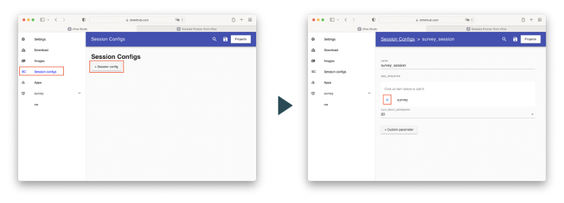

<p align = "center">
Figure 10: Config Session
</p>

One more step, go to the session config page and click the plus button to add the *survey* session. 

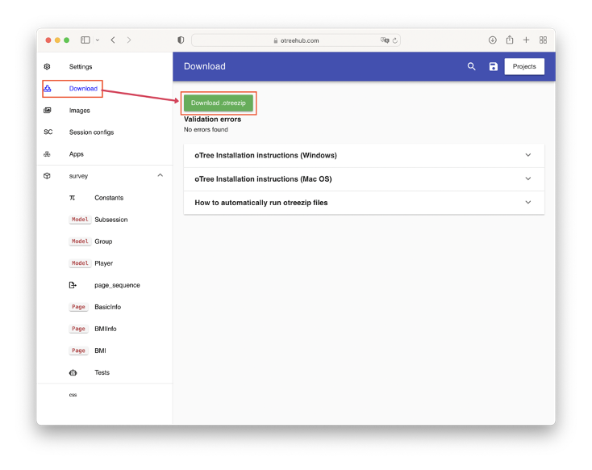

<p align = "center">
Figure 11: Project Download
</p>

Finally, go to the **download** page and click the **“Download .otreezip”** button to download the project. 


<p align = "center">
Figure 12: Downloaded Project File
</p>

#### Use PyCharm to Customize the Project (Optional)

After creating and customizing your project on oTree Studio, you can also further customize your project using PyCharm or other IDE. First, you need to unpack your downloaded `.otreezip` file. To do this, run:

```shell
otree unzip xxxxxxx.otreezip
```

The command will produce a folder with an identical name. Use PyCharm to open that folder.

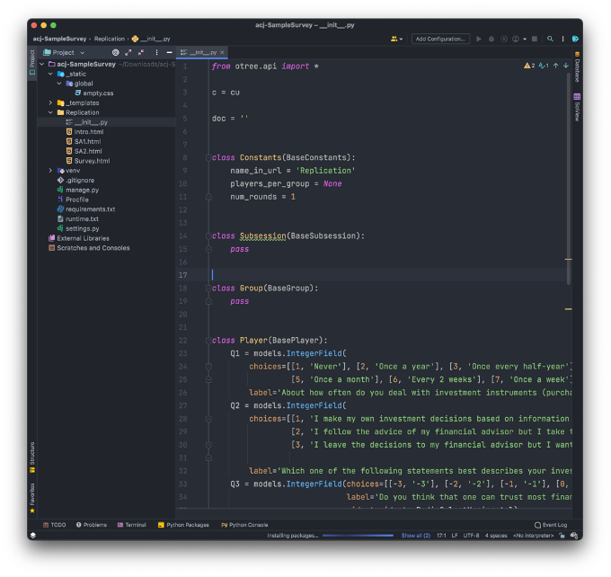

<p align = "center">
Figure 13: Use PyCharm to Open the Project
</p>

Then, you can add python code to further customize the project. After adding your code, run the following command to re-pack the project into the `.otreezip` file:

```shell
otree zip
```

### Host the App

#### Locally

Open a terminal/Command Prompt on your computer and change the working directory to where you store your previously downloaded project file. 

Execute the following command to start an oTree test server:

```shell
otree zipserver
```


<p align = "center">
Figure 14: Run oTree Server
</p>

Then, you can open http://localhost:8000/ in your browser to test your project out. 

#### On Heroku from oTree Studio

Heroku is a website hosting service where you can easily host your oTree application and open access to the public. 

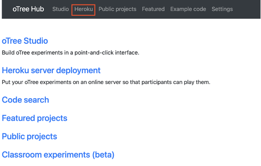

<p align = "center">
Figure 15: Direct to Heroku
</p>

First, go to your [oTreeHub](https://www.otreehub.com/my_projects/) and click **Heroku**. Then, follow the guidance on the web page to connect your oTreeHub to your Heroku account. 

*Note: this method requires you to have a verified heroku account. Please go to [Heroku](https://www.heroku.com/) website to register one and add a credit card to your account for verification. You shall not be charged. Please exercise your caution.*

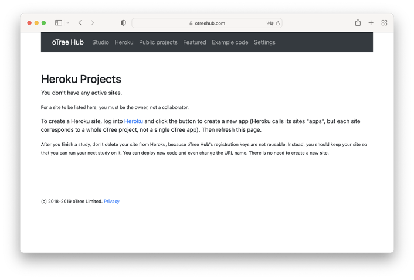

<p align = "center">
Figure 16: Linked Account
</p>

After linking the accounts, your oTree Hub page should be looking identical to figure 16. 

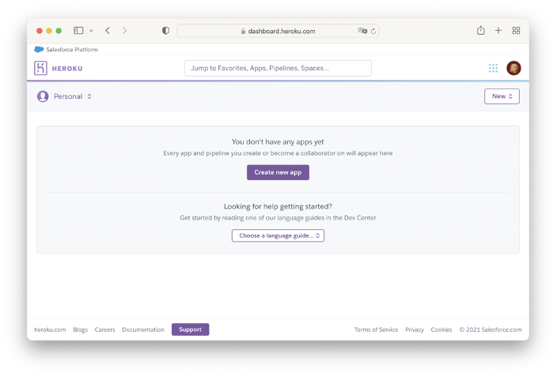

<p align = "center">
Figure 17: Heroku Dashboard
</p>

Next, go to your heroku dashboard and click **“Create new app”**. After creating the app, refresh your oTree Hub page, then click the **“register”** button.

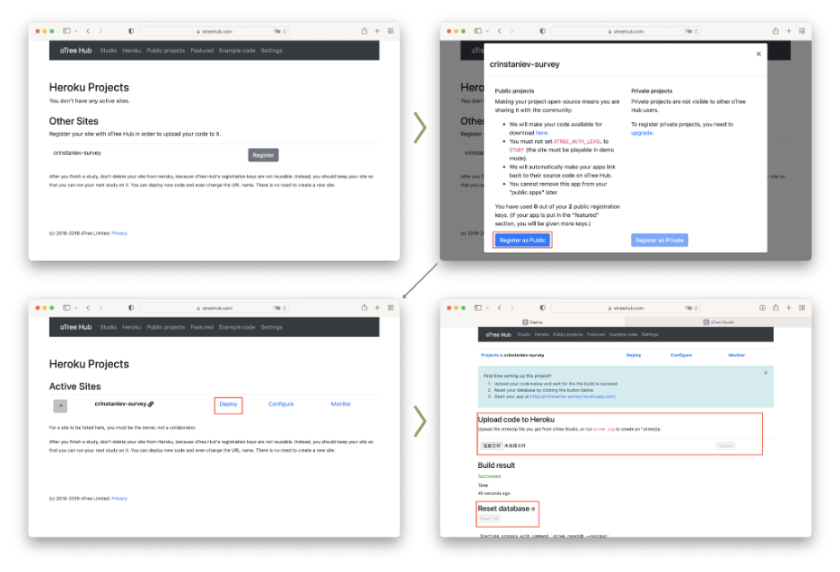

<p align = "center">
Figure 18: Deploy Project
</p>

Then, click **“Register as Public”** to finish registration, then click the **“deploy”** button. Next, upload the `.otreezip` file of your project to oTree Hub then click reset the database.


<p align = "center">
Figure 19: Project Deployed
</p>

Finally, you have your project deployed on Heroku. Click the link shown in figure 19 to access your website.

### Run the App


<p align = "center">
Figure 20: Test the Project
</p>

Finally, you can open your project link to test it out. Figure 20 illustrates the flow of this survey. First, we click the project and select a single-used link to get started. On the first page, we input our name and select the gender, then, on the second page, we input our height and weight. Finally, the app evaluates our BMI and displays our information on the third page, then the survey is completed. Up to now, you have the ability to create a simple survey application with oTree.

## Conclusion

In this instruction, firstly, we learned how to do the environment configuration and the installation of oTree. Secondly, we create and configure the project with oTree studio. Thirdly, we create variables and pages, then define the flow of the survey. Then, we download the survey application and deploy it on both local and Heroku. Finally, we test out the application. This instruction does not cover most of the other features of oTree, so if you are interested in learning more, please refer to [the official oTree documentation](https://otree.readthedocs.io/en/latest/install.html).  It is worth noting that this instruction only describes how to use the oTree studio to create apps. oTree can also be used programmatically which brings higher flexibility. The exact method can also be found in the official documentation.
