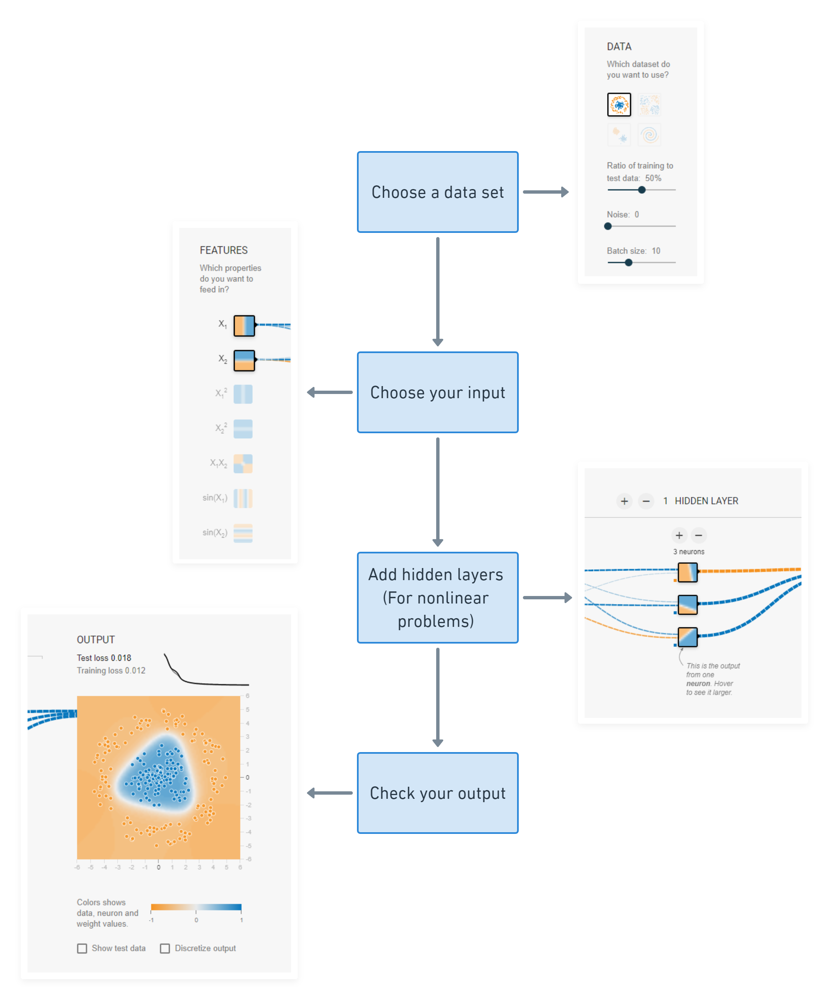
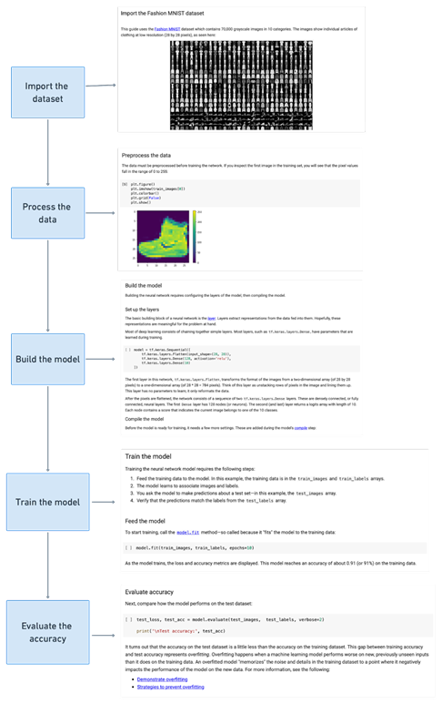
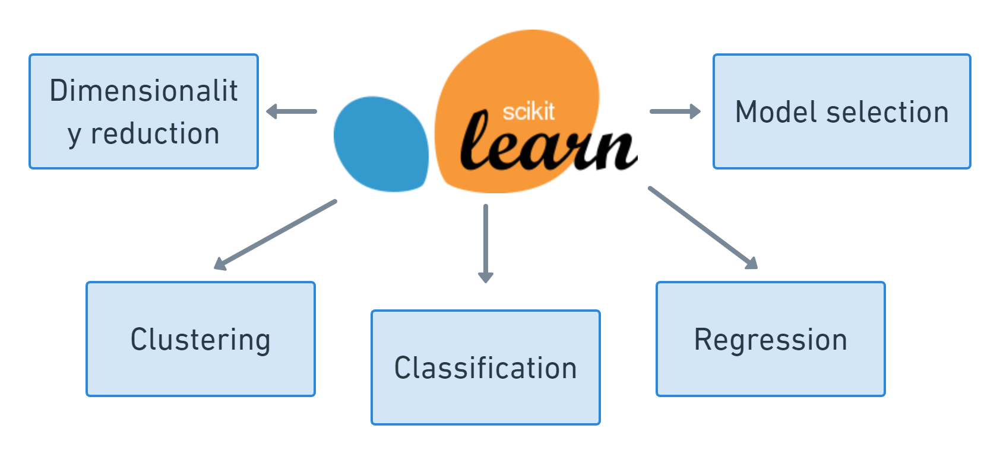
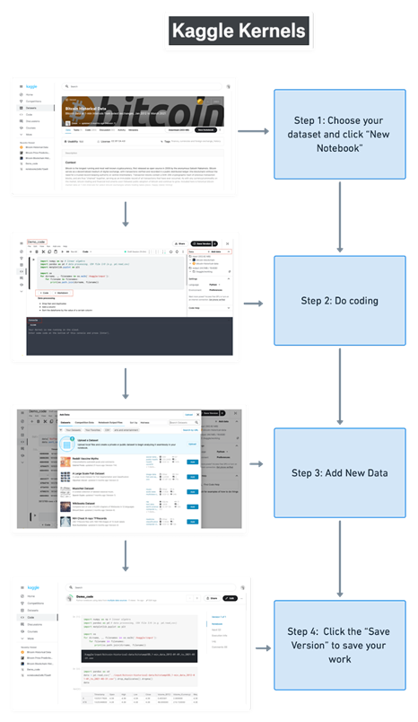

# Project 3: Software and Packages for Empirical Research: Statistic Tests, Econometrics, and Machine Learning
# About
In this instruction document, we introduce 11 useful tools for Economics: Neural Network Playground, TensorFlow, PyTorch, Eli5, Scipy, Statsmodel, Pingouin, SKlearn (scikit-learn), Keras, FinTA, and Kaggle Kernel. Basic information is provided for every tool, including introduction, license, required citation for this tool. Also, we provide examples for three of the tools: TensorFlow, SKlearn and Kaggle Kernel. We hope this project would be helpful for those who want to conduct machine learning and statistical analysis in the field of economics.

# Table of Contents

### [1. Introduction](#Introduction)

### [2. Neural Network Playground](#Neural-Network-Playground)

### [3. TensorFlow](#TensorFlow)

### [4. PyTorch](#PyTorch)

### [5. Eli5](#Eli5)

### [6. SciPy](#SciPy)

### [7. Statsmodel](#Statsmodel)

### [8. Pingouin](#Pingouin)

### [9. SKlearn (scikit-learn)](#SKlearn-(scikit-learn))

### [10. Keras](#Keras)

### [11. FinTA](#FinTA)

### [12. Kaggle Kernel](#Kaggle-Kernel)

# Neural Network Playground
## 1. Introduction
[Neural Network Playground](http://playground.tensorflow.org/#activation=tanh&batchSize=10&dataset=circle&regDataset=reg-plane&learningRate=0.03&regularizationRate=0&noise=0&networkShape=4,2&seed=0.40061&showTestData=false&discretize=false&percTrainData=50&x=true&y=true&xTimesY=false&xSquared=false&ySquared=false&cosX=false&sinX=false&cosY=false&sinY=false&collectStats=false&problem=classification&initZero=false&hideText=false) is a web app written in JavaScript running in your browser. It lets you play with a real neural network and visualize it ([Sato](https://cloud.google.com/blog/products/ai-machine-learning/understanding-neural-networks-with-tensorflow-playground), 2016). Check its [Github repo](https://github.com/tensorflow/playground) for more details

## 2. License
Neural Network Playground is a Free/Open Source software, released under the terms of the Apache-2.0 License.
## 3. Required Citation
M. Abadi, A. Agarwal, P. Barham, E. Brevdo, Z. Chen, C. Citro, G. S. Corrado, A. Davis, J. Dean, M. Devin, S. Ghemawat, I. Goodfellow, A. Harp, G. Irving, M. Isard, Y. Jia, R. Jozefowicz, L. Kaiser, M. Kudlur, J. Levenberg, D. Man´e, R. Monga, S. Moore, D. Murray, C. Olah, M. Schuster, J. Shlens, B. Steiner, I. Sutskever, K. Talwar, P. Tucker, V. Vanhoucke, V. Vasudevan, F. Vi´egas, O. Vinyals, P. Warden, M. Wattenberg, M. Wicke, Y. Yu, and X. Zheng. TensorFlow: Large-scale machine learning on heterogeneous systems, 2015. Software available from tensorflow.org.
## 4. Example
<!--  -->

<b><i>Figure 1: Neural Network Playground Example</i></b>

<!-- ***Figure 1: Neural Network Playground Example*** -->

# TensorFlow
## 1. Introduction
[TensorFlow](https://www.tensorflow.org) is a free and open-source software library used for machine learning. It can be applied for solving various tasks but has a focus on training deep neural networks.

## 2. License
TensorFlow is a free and open Source software, released under the terms of the Apache License 2.0. 
## 3. Required Citation
M. Abadi, A. Agarwal, P. Barham, E. Brevdo, Z. Chen, C. Citro, G. S. Corrado, A. Davis, J. Dean, M. Devin, S. Ghemawat, I. Goodfellow, A. Harp, G. Irving, M. Isard, Y. Jia, R. Jozefowicz, L. Kaiser, M. Kudlur, J. Levenberg, D. Man´e, R. Monga, S. Moore, D. Murray, C. Olah, M. Schuster, J. Shlens, B. Steiner, I. Sutskever, K. Talwar, P. Tucker, V. Vanhoucke, V. Vasudevan, F. Vi´egas, O. Vinyals, P. Warden, M. Wattenberg, M. Wicke, Y. Yu, and X. Zheng. TensorFlow: Large-scale machine learning on heterogeneous systems, 2015. Software available from tensorflow.org.
## 4. Example
Figure 2 presents  how to classify images of clothing by TensorFlow. The example is provided by the [TensorFlow official website](https://www.tensorflow.org/tutorials/keras/classification). 

<b><i>Figure 2: TensorFlow Example: Classify images of clothing</i></b>

<!-- 
***Figure 2: TensorFlow Example: Classify images of clothing*** -->

# PyTorch
### 1. Introduction
[PyTorch](https://pytorch.org/) is an open-source machine learning library which is based on the Torch library. It can be used in fields such as computer vision and natural language processing (NLP).

### 2. License
PyTorch is a free and open Source software, released under the BSD License. 
### 3. Required Citation
Paszke, A., Gross, S., Massa, F., Lerer, A., Bradbury, J., Chanan, G., Chintala, S. PyTorch: An Imperative Style, High-Performance Deep Learning Library. In Advances in Neural Information Processing Systems 32 (pp. 8024–8035). Curran Associates, Inc. 2019. Retrieved from http://papers.neurips.cc/paper/9015-pytorch-an-imperative-style-high-performance-deep-learning-library.pdf 

# Eli5
### 1. Introduction
[ELI5](https://eli5.readthedocs.io/en/latest/overview.html) is a Python library which allows users to visualize and debug various Machine Learning models using the unified API. It has built-in support for several ML frameworks and provides a way to explain black-box models ([ELI5](https://eli5.readthedocs.io/en/latest/overview.html), 2017).

### 2. License
Eli5 is a free and open Source software, released under the MIT License. 
### 3. Required Citation
Angela Fan, Yacine Jernite, Ethan Perez, David Grangier, Jason Weston, Michael Auli. ELI5: Long Form Question Answering, Proceedings of ACL 2019. 

# SciPy
### 1. Introduction
[SciPy](https://scipy.org/) is a free and open-source Python library and math toolkit. It can be used for scientific and technical computing.

### 2. License
SciPy is a free and open Source software, released under the BSD License.
### 3. Required Citation
Pauli Virtanen, Ralf Gommers, Travis E. Oliphant, Matt Haberland, Tyler Reddy, David Cournapeau, Evgeni Burovski, Pearu Peterson, Warren Weckesser, Jonathan Bright, Stéfan J. van der Walt, Matthew Brett, Joshua Wilson, K. Jarrod Millman, Nikolay Mayorov, Andrew R. J. Nelson, Eric Jones, Robert Kern, Eric Larson, CJ Carey, İlhan Polat, Yu Feng, Eric W. Moore, Jake VanderPlas, Denis Laxalde, Josef Perktold, Robert Cimrman, Ian Henriksen, E.A. Quintero, Charles R Harris, Anne M. Archibald, Antônio H. Ribeiro, Fabian Pedregosa, Paul van Mulbregt, and SciPy 1.0 Contributors. (2020) SciPy 1.0: Fundamental Algorithms for Scientific Computing in Python. Nature Methods, 17(3), 261-272.

# Statsmodel
### 1. Introduction
[Statsmodels](https://www.statsmodels.org/) is a Python package that allows users to browse, estimate statistical models, and perform statistical tests.

### 2. License
Statsmodel is a free and open-source software, released under the open-source Modified BSD (3-clause) license.
### 3. Required Citation
Seabold, S., & Perktold, J. statsmodels: Econometric and statistical modeling with python. 2010. In 9th Python in Science Conference.

# Pingouin 
### 1. Introduction
[Pingouin](https://pingouin-stats.org/index.html) is an open-source statistical package written in Python 3 and based mostly on Pandas and NumPy ([Pingouin](https://pingouin-stats.org), 2021). 

### 2. License
Pingouin is a free and open-source software, released under the GNU General Public License v3.0.
### 3. Required Citation
Vallat, R. (2018). Pingouin: statistics in Python. Journal of Open Source Software, 3(31), 1026, https://doi.org/10.21105/joss.01026

# SKlearn (scikit-learn)
### 1. Introduction
[Scikit-learn](https://scikit-learn.org/stable/) is a free software machine learning library for the Python programming language.

<b><i>Figure 3: SKlearn flowchart</i></b>

<!-- 

***Figure 3: SKlearn flowchart*** -->

### 2. License
Scikit-learn is open source and free to use software under the BSD License.
### 3. Required Citation
Scikit-learn: Machine Learning in Python, Pedregosa et al., JMLR 12, pp. 2825-2830, 2011.
### 4. Example
Figure 2 shows how scikit-learn can be used to recognize images of hand-written digits, from 0-9. Check [Colab Notebook: scikit-learn hand-written digits recognition](https://github.com/SciEcon/Intelligent-Economics/blob/main/project3/plot_digits_classification.ipynb) for more details.

<b><i>Figure 4: SKlearn Example</i></b>

<!-- 
***Figure 4: SKlearn Example*** -->

# Keras
### 1. Introduction
[Keras](https://keras.io/) is an open-source neural network library written in Python that can be run on TensorFlow, Microsoft Cognitive Toolkit, Theano, and PlaidML.

### 2. License
Scikit-learn is open-source and free to use software under the MIT License.

### 3. Required Citation
Chollet, F., & others. (2015). Keras. GitHub. Retrieved from https://github.com/fchollet/keras

# FinTA
### 1. Introduction
[FinTA (Financial Technical Analysis)](https://pypi.org/project/finta/0.3.3/) is a python package which provides common financial technical indicators implemented in Pandas ([FinTA](https://pypi.org/project/finta/0.3.3/), 2018).
### 2. License
FinA is open-source and free to use software under the LGPL-3.0 license. 
### 3. Required Citation
Pauli Virtanen, Ralf Gommers, Travis E. Oliphant, Matt Haberland, Tyler Reddy, David Cournapeau, Evgeni Burovski, Pearu Peterson, Warren Weckesser, Jonathan Bright, Stéfan J. van der Walt, Matthew Brett, Joshua Wilson, K. Jarrod Millman, Nikolay Mayorov, Andrew R. J. Nelson, Eric Jones, Robert Kern, Eric Larson, CJ Carey, İlhan Polat, Yu Feng, Eric W. Moore, Jake VanderPlas, Denis Laxalde, Josef Perktold, Robert Cimrman, Ian Henriksen, E.A. Quintero, Charles R Harris, Anne M. Archibald, Antônio H. Ribeiro, Fabian Pedregosa, Paul van Mulbregt, and SciPy 1.0 Contributors. (2020) SciPy 1.0: Fundamental Algorithms for Scientific Computing in Python. Nature Methods, 17(3), 261-272.

# Kaggle Kernel 
### 1. Introduction
[Kaggle](https://www.kaggle.com) Kernels are essentially Jupyter notebooks in the browser, which means that users can save themselves the hassle of setting up a local environment, and have a Jupyter notebook environment inside the browser ([Yufeng](https://towardsdatascience.com/introduction-to-kaggle-kernels-2ad754ebf77), 2017).
### 2. Example
Figure 5 shows an example of Kaggle Kernel to do data processing and simple machine learning based on the dataset on Kaggle. Check [this example](https://www.kaggle.com/chenyuwangcw417/demo-code) for more details. 

<b><i>Figure 5: Kaggle Kernel Example</i></b>

<!-- 
***Figure 5: Kaggle Kernel Example*** -->

# Case Studies
In this section, we provide three case studies for TensorFlow, Scikit-Learn, and Kaggle Kernel. [The case of TensorFlow](https://www.tensorflow.org/tutorials/keras/classification) is provided by the TensorFlow official website, which trains a neural network model to classify images of clothing; [The case of Scikit-Learn](https://github.com/SciEcon/Intelligent-Economics/blob/main/project3/plot_digits_classification.ipynb) shows how scikit-learn can be used to recognize images of hand-written digits, from 0-9; [The case of Kaggle Kernel](https://www.kaggle.com/chenyuwangcw417/kaggle-kernel-example) presents how to do data processing and machine learning based on the Kaggle dataset related to Bitcoin. By time series algorithm, we can predict the Bitcoin prices according to the previous ones. 
